# Screenshots

> ⚠️ **For illustrative purposes only.** All catalog imagery is **sample TMDB metadata**
> captured in a tvOS Simulator to demonstrate the interface. LumoraTV ships with **no content
> of its own** — it is a player for sources *you* configure and own. Nothing here hosts,
> distributes, or promotes piracy. Content-bearing shots carry a visible watermark to make
> this explicit.

## Home & content

| | |
|---|---|
| 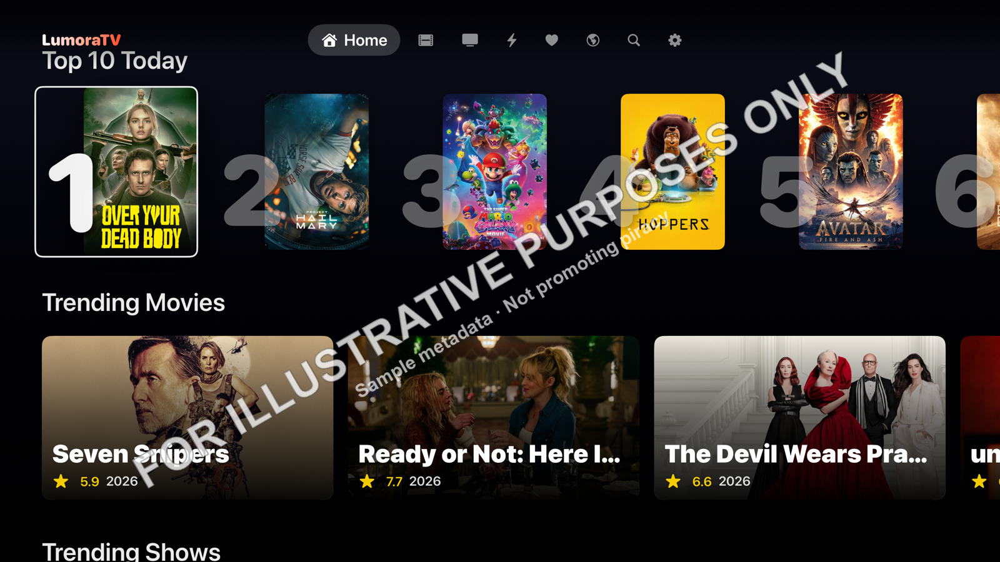 **Home** — Top 10 row | 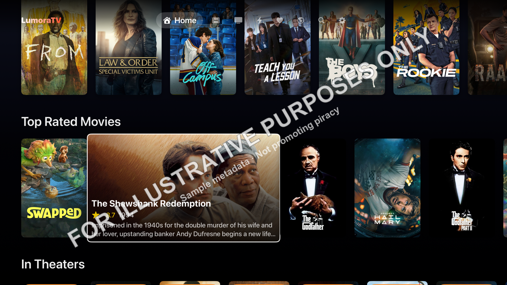 **Home** — Top Rated, focused card |
| 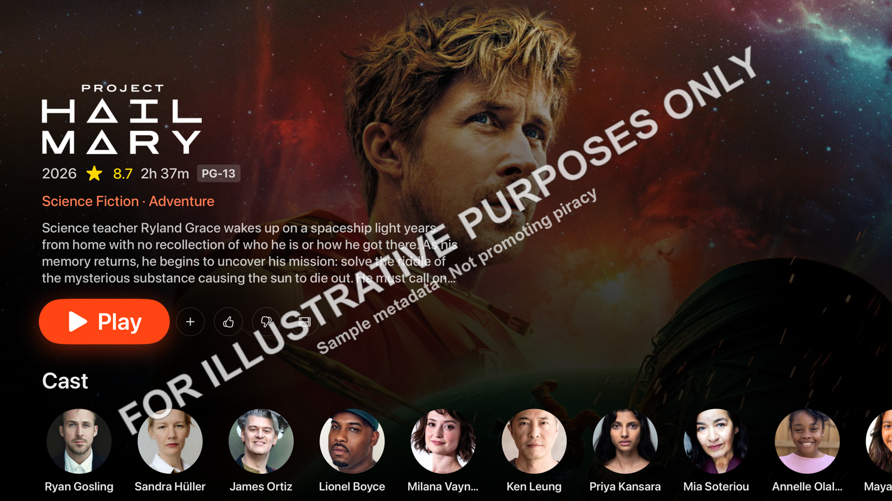 **Detail** — movie | 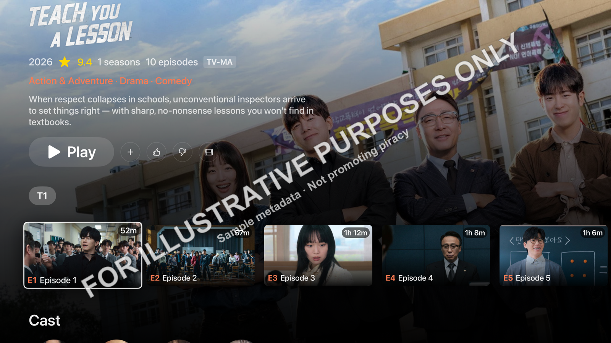 **Detail** — series, episodes |

## Browse by category

| | |
|---|---|
| 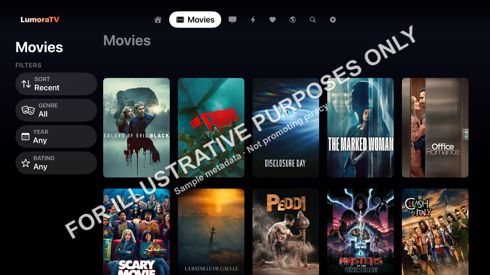 **Movies** | 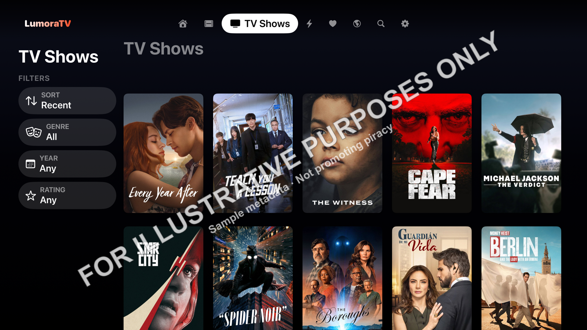 **TV Shows** |
| 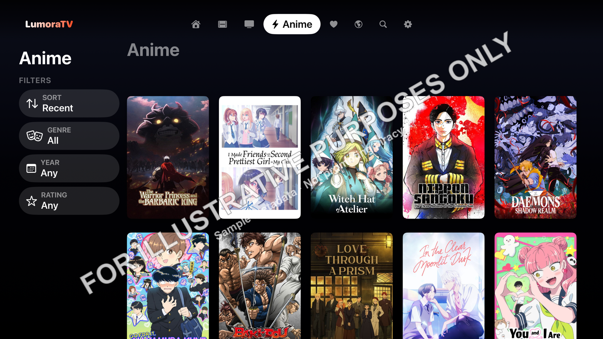 **Anime** | 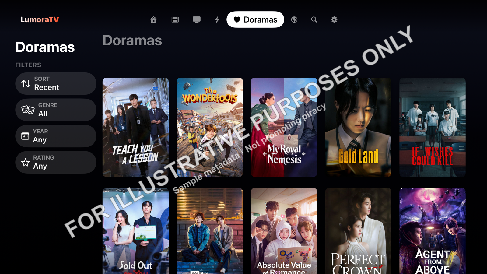 **Doramas** |
| 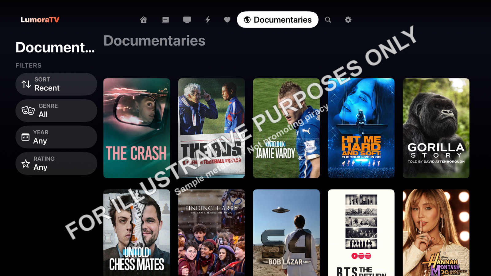 **Documentaries** | |

## Onboarding & settings

| | |
|---|---|
| 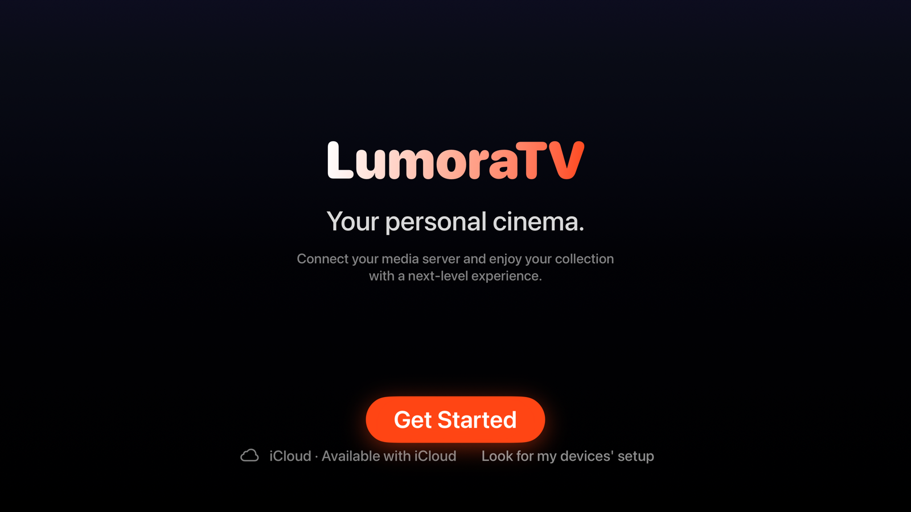 **Welcome** | 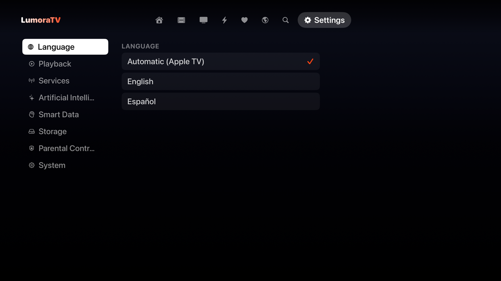 **Settings** — Language |
| 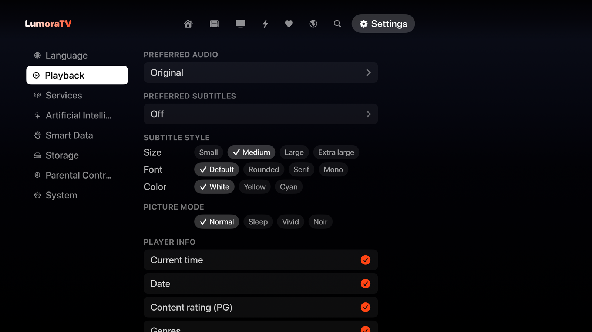 **Settings** — Playback | 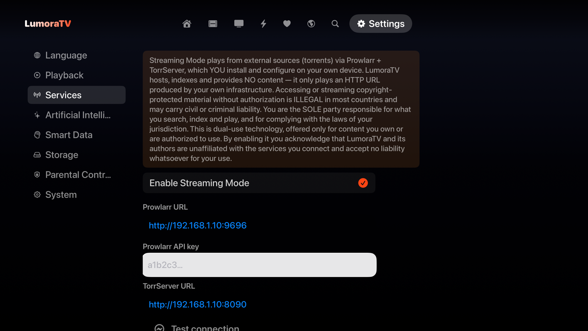 **Settings** — Services (example values) |
| 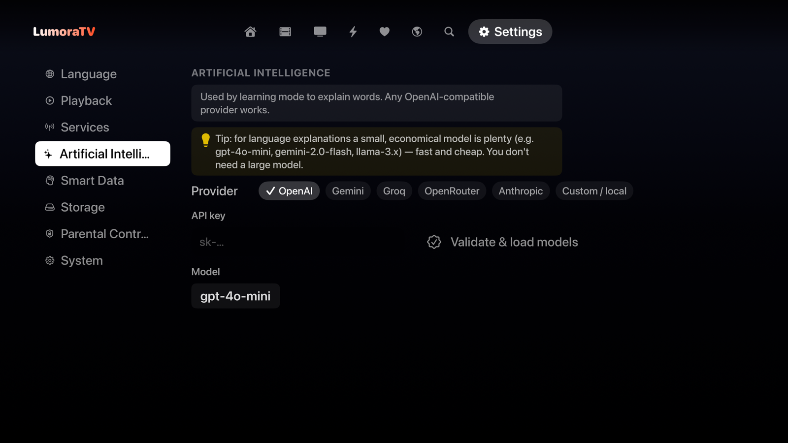 **Settings** — AI tutor | 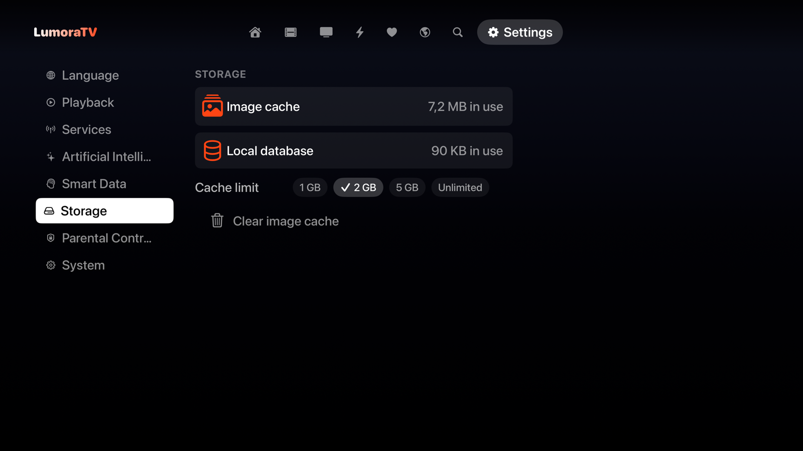 **Settings** — Storage |

---

*Captured on the tvOS Simulator (free build, no playback). Settings screens show placeholder/example
configuration values, not real endpoints.*
